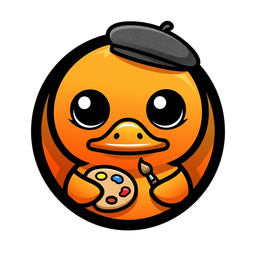
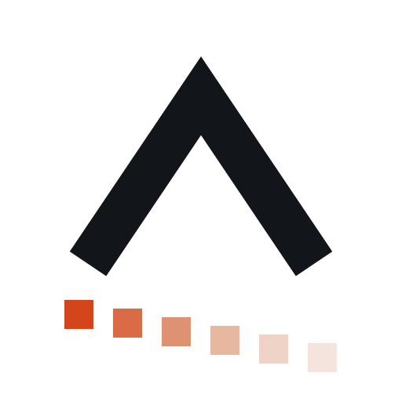
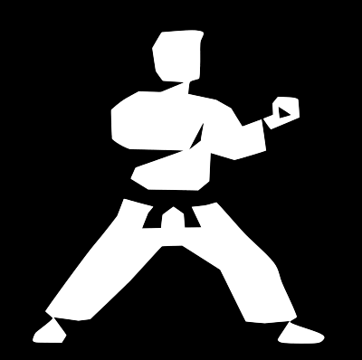

# Pier-Jean Malandrino

**CTO @ [SCUB](https://scub.net)** · AI & document intelligence

I build products around intelligent document processing and write about software architecture, applied AI, and engineering craft.

  

---

### What I build

&nbsp;&nbsp;&nbsp;

- **[Docling Studio](https://github.com/scub-france/Docling-Studio)** : drop a PDF in the browser, set up the Docling pipeline, and see what actually comes out of it page by page. Text, tables, figures, bounding boxes, chunks, then export to Markdown or push straight to a vector index.
- **[Llvq](https://github.com/pjmalandrino/llvq)** : Leech lattice quantization for LLM weights, written from scratch in Rust. Qwen3-4B at roughly 2 bits per weight, with a CUDA kernel that reads the packed weights on the card, so the memory goes down and the tokens per second do not.

### What I contribute to

&nbsp;&nbsp;&nbsp;

&nbsp;&nbsp;&nbsp;

- **[Docling-agent](https://github.com/docling-project/docling-agent)** : an agent layer on top of DoclingDocument for writing, editing and enriching documents, with the model backend left to you.
- **[Candle](https://github.com/huggingface/candle)** : the minimal ML framework for Rust from Hugging Face. Llvq runs its models on it, so most of what I send back comes out of that work.
- **[Karate](https://github.com/karatelabs/karate)** : one framework for API and UI testing, plus mocks and performance, all in the same file. I am currently building Karate Agent on top of it.

### Stack

### Contributions

<picture>
  <source media="(prefers-color-scheme: dark)" srcset="https://raw.githubusercontent.com/pjmalandrino/pjmalandrino/output/github-snake-dark.svg"/>
  <source media="(prefers-color-scheme: light)" srcset="https://raw.githubusercontent.com/pjmalandrino/pjmalandrino/output/github-snake.svg"/>
  
</picture>

### Elsewhere

[LinkedIn](https://www.linkedin.com/in/pier-jean-malandrino/) · [Medium](https://medium.com/@pier-jean-malandrino) · [DZone](https://dzone.com/users/5765872/pier-jean-malandrino.html) · [X](https://x.com/pjmalandrino)
